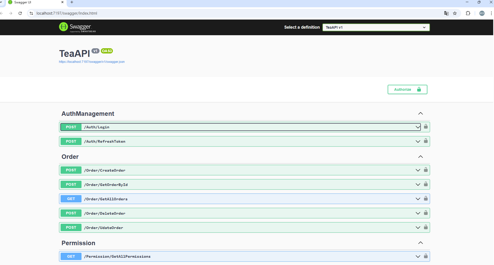

# TeaAPI

## 1️⃣ 建立資料庫
請先完成 **資料庫初始化**，詳細資訊請參考 **[Tea-Order-Manage-Database](https://github.com/Jacky0624/Tea-Order-Manage-Database)**。

## 2️⃣ 修改 `appsettings.json` 連接字串
為了讓 `TeaAPI` 正確連接到 **Tea-Order-Manage-Database**，請修改 `appsettings.json` 檔案，更新 **資料庫連接字串 (`ConnectionStrings`)**。

📌 **示例 (`appsettings.json`)**：
```json
"ConnectionStrings": {
  "DefaultConnection": "Server=YOUR_SERVER;Database=TeaOrderDB;User Id=YOUR_USER;Password=YOUR_PASSWORD;TrustServerCertificate=True;"
}
```

## 3️⃣ 設定 JWT Token 的 Key
為了讓 `TeaAPI` 正確處理 **JWT 身份驗證**，請在 `appsettings.json` 中設定 **JWTConfig**。

📌 **示例 (`appsettings.json`)**：
```json
"JWTConfig": {
  "SecretKey": "e6a76ff24e3cc361f55d74bd170501e56de39712bd5a0a9f3s524c569908442b",
  "ExpirationMinutes": 15,
  "Issuer": "tea",
  "Audience": "kingston"
}
```

## 4️⃣ 設定前端 Allow Origin（CORS）
為了讓 `TeaAPI` 允許前端（如 Angular、React）訪問，請在 `appsettings.json` 中設定 **允許的來源 (`AllowedOrigins`)**。

📌 **示例 (`appsettings.json`)**：
```json
"AllowedOrigins": [
  "http://localhost:4200"
]
```

## 5️⃣ 啟動 API 並測試 Swagger 介面
執行以下指令啟動 `TeaAPI`：
```sh
dotnet run
```
執行後，應該會自動開啟 **Swagger 介面** (`http://localhost:5000/swagger` 或 `http://localhost:5001/swagger`)，你可以使用 Swagger 測試 API。

📌 **如果沒有自動開啟 Swagger，請手動在瀏覽器輸入以下網址**：
```
http://localhost:7197/swagger
```

🚀 **Swagger 提供視覺化的 API 測試工具，開發者可以直接在瀏覽器內測試所有 API！**
